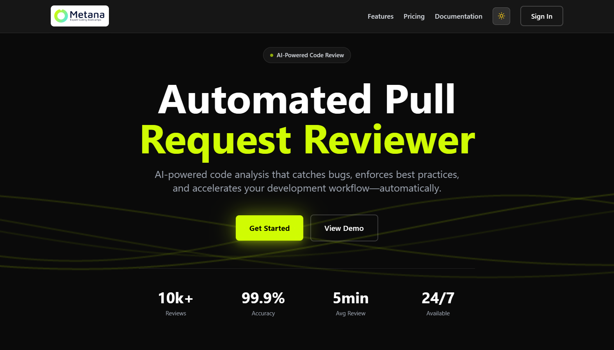
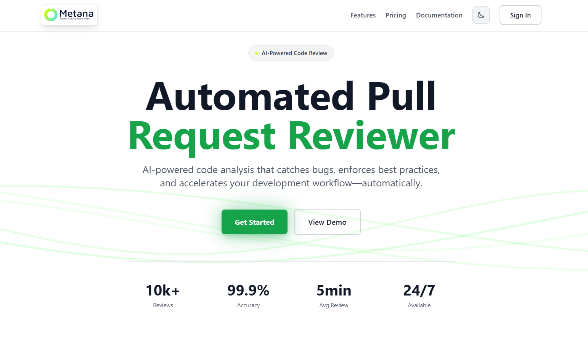
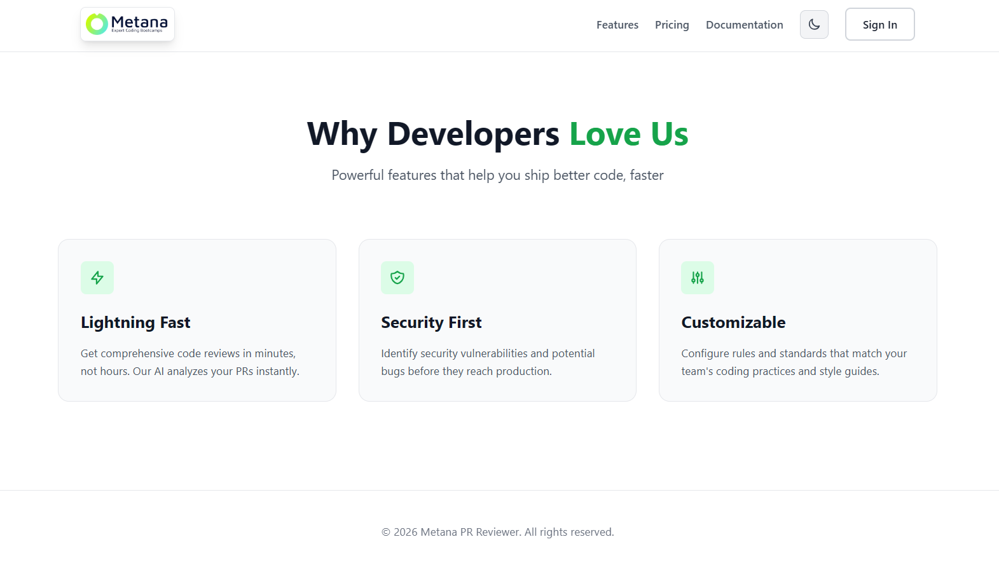
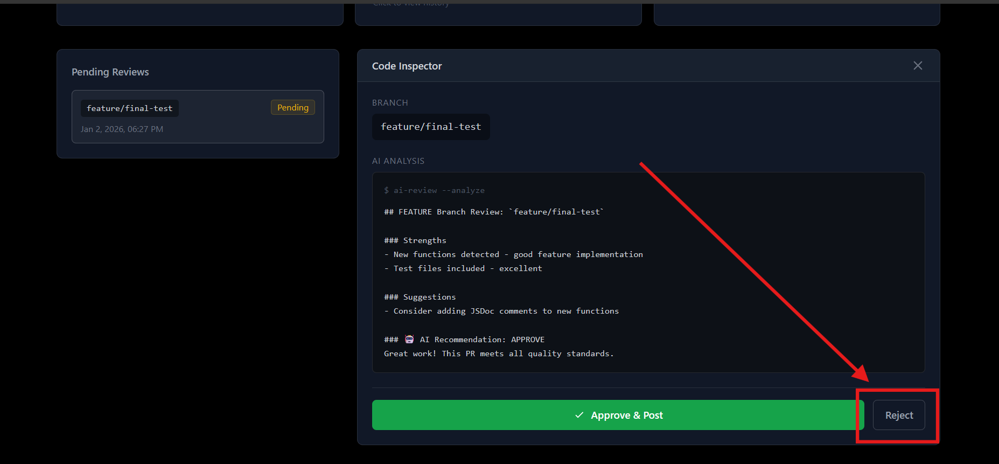
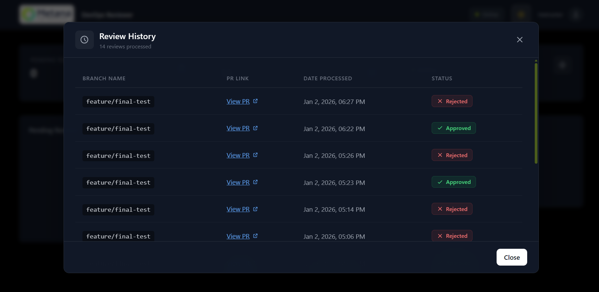

<div align="center">


#  Automated Pull Request Reviewer

### AI-Powered Code Review System with Instructor Gatekeeping

[](https://nodejs.org/)
[](https://reactjs.org/)
[](https://www.sqlite.org/)
[](https://www.prisma.io/)
[](https://docs.github.com/en/webhooks)

**[📄 Download Technical Report](./frontend/src/pp/Metana_DevOps_Assessment_karindra_gimhan.pdf)**

</div>

---

## 🎯 Introduction

The **Automated Pull Request Reviewer** is a full-stack DevOps solution designed to streamline the code review process for educational institutions and development teams. By leveraging **GitHub Webhooks**, **AI-powered analysis**, and a **professional Instructor Dashboard**, this system automatically reviews pull requests based on intelligent branch-naming conventions and provides instant feedback to developers.

This tool bridges the gap between automated CI/CD pipelines and manual code review, offering:
- ✅ **Real-time PR analysis** triggered by GitHub events
- 🧠 **Smart branch-based review logic** (feature/, hotfix/, main)
- 👨‍🏫 **Instructor gatekeeping** with approve/reject capabilities
- 🌐 **GitHub API integration** for automated status updates
- 📊 **Comprehensive audit logging** with review history

Perfect for **DevOps bootcamps**, **code academies**, and **development teams** seeking to enforce best practices while maintaining human oversight.

---

## ✨ Key Features

### 🤖 **AI-Powered Review Analysis**
- Automatically analyzes code changes based on branch naming conventions
- Detects new functions, tests, documentation, and code patterns
- Provides detailed feedback with strengths, issues, and suggestions
- Supports feature/, hotfix/, bugfix/, and custom branch types

### 🌿 **Intelligent Branch-Based Logic**
- **Feature Branches**: Checks for tests, documentation, and proper implementation
- **Hotfix Branches**: Enforces minimal changes (<100 lines) and focused fixes
- **Main/Master Branches**: Blocks direct commits, enforces PR workflow
- Custom severity levels: CRITICAL, MAJOR, MINOR, INFO

### 👨‍🏫 **Instructor Dashboard & Gatekeeping**
- Clean, professional SaaS-style interface with dark/light themes
- Review queue with pending PRs awaiting approval
- One-click approve/reject actions with GitHub integration
- Real-time status updates and processed review counter
- History modal showing complete audit trail

### 🔗 **Seamless GitHub Integration**
- Webhook-based architecture for instant PR detection
- Automatic comment posting on GitHub PRs
- REQUEST_CHANGES event for rejected PRs (with fallback to COMMENT)
- Handles self-review restrictions gracefully
- Supports private repositories with token authentication

### 🎨 **Modern User Experience**
- Responsive design with Tailwind CSS
- Dark/light theme toggle with system preference detection
- Glassmorphism UI elements and smooth animations
- Professional color scheme (subtle grays, minimal neon accents)
- Optimized for desktop and mobile viewing

---

## 📸 Interface Showcase

### 🌙 Dark Mode Dashboard
The main instructor interface showing pending reviews, AI analysis, and action buttons.



### ☀️ Light Mode & Landing Page
Theme adaptability demonstration with professional light theme and welcoming landing page.

<div align="center">
  
  
</div>

### ⛔ Rejection Workflow
Demonstrates the instructor reject action with GitHub API integration for blocking merges.



### 📋 Audit History Modal
Complete history of all processed reviews with status badges and timestamps.



---

## 🛠️ Tech Stack

### **Backend**
- **Node.js** (v18.x) - JavaScript runtime
- **Express.js** - RESTful API framework
- **Prisma ORM** - Database management with migrations
- **SQLite** - Lightweight relational database
- **Octokit** - GitHub REST API client
- **dotenv** - Environment variable management

### **Frontend**
- **React** (v18.x) - UI component library
- **Vite** - Fast build tool and dev server
- **Tailwind CSS** - Utility-first CSS framework
- **Axios** - HTTP client for API calls

### **DevOps & Tools**
- **Ngrok** - Secure tunneling for local webhook testing
- **GitHub Webhooks** - Real-time PR event notifications
- **Nodemon** - Auto-restart development server
- **ESLint** - Code quality and consistency

---

## 🚀 Installation & Setup

### **Prerequisites**
- Node.js v18.x or higher
- npm or yarn package manager
- GitHub account with a test repository
- Ngrok account (free tier works)

### **1️⃣ Clone the Repository**
```bash
git clone https://github.com/yourusername/metana-pr-reviewer.git
cd metana-pr-reviewer
```

### **2️⃣ Backend Setup**

```bash
# Navigate to backend directory
cd backend

# Install dependencies
npm install

# Create .env file with your GitHub token
echo "GITHUB_TOKEN=your_github_personal_access_token" > .env
echo "DATABASE_URL=file:./dev.db" >> .env
echo "PORT=3000" >> .env

# Run Prisma migrations to create database
npx prisma migrate dev --name init

# Start the backend server
npm run dev
```

**Backend should now be running on:** `http://localhost:3000`

**Generate GitHub Token:**
1. Go to GitHub Settings → Developer settings → Personal access tokens → Tokens (classic)
2. Generate new token with `repo` scope (full control of private repositories)
3. Copy the token and paste it in your `.env` file

### **3️⃣ Frontend Setup**

```bash
# Navigate to frontend directory (from project root)
cd frontend

# Install dependencies
npm install

# Start the frontend development server
npm run dev
```

**Frontend should now be running on:** `http://localhost:5173`

### **4️⃣ Ngrok Setup (For GitHub Webhooks)**

To receive GitHub webhook events on your local machine:

```bash
# Install Ngrok globally (if not installed)
npm install -g ngrok

# Start Ngrok tunnel to backend port
ngrok http 3000
```

**Copy the Forwarding URL** (e.g., `https://abc123.ngrok.io`)

### **5️⃣ Configure GitHub Webhook**

1. Go to your GitHub repository → **Settings** → **Webhooks** → **Add webhook**
2. Set **Payload URL**: `https://your-ngrok-url.ngrok.io/webhook/github`
3. Set **Content type**: `application/json`
4. Select events: **Pull requests** (check "Let me select individual events")
5. Ensure webhook is **Active**
6. Click **Add webhook**

**Test the webhook:**
- Open a new PR in your repository
- Check the backend terminal for `Processing PR #X: opened`
- Review should appear in the Dashboard at `http://localhost:5173/dashboard`

---

## 📖 Usage Guide

### **For Developers (Students)**
1. **Create a feature branch** following naming conventions:
   - `feature/add-login-page` - For new features
   - `hotfix/fix-critical-bug` - For urgent fixes
   - `bugfix/resolve-null-error` - For bug fixes

2. **Open a Pull Request** on GitHub

3. **AI Review is automatic** - The system analyzes your code and posts feedback as a comment

4. **Wait for instructor approval** - Your PR will be in "Pending" status

### **For Instructors**
1. **Access the Dashboard** at `http://localhost:5173/dashboard`

2. **Review pending PRs** in the left panel

3. **Click on a review** to see AI analysis and branch details

4. **Take action:**
   - ✅ **Approve & Post** - Approves the PR and posts confirmation to GitHub
   - ❌ **Reject** - Requests changes on GitHub (blocks merge)

5. **View history** by clicking the "Total Processed" card

### **API Endpoints**
```
GET  /api/reviews          - Fetch pending reviews (default) or all (?status=all)
POST /api/reviews/:id/approve - Approve a review and post to GitHub
POST /api/reviews/:id/reject  - Reject a review with GitHub REQUEST_CHANGES
POST /webhook/github      - GitHub webhook endpoint (receives PR events)
```

---

## 🏗️ Project Structure

```
metana-pr-reviewer/
├── backend/
│   ├── src/
│   │   ├── controllers/
│   │   │   ├── reviewController.js    # API logic for reviews
│   │   │   └── webhookController.js   # GitHub webhook handler
│   │   ├── routes/
│   │   │   ├── reviewRoutes.js        # Review API routes
│   │   │   └── webhook.js             # Webhook routes
│   │   ├── services/
│   │   │   └── reviewService.js       # AI analysis logic
│   │   └── config/
│   │       └── database.js            # Prisma client
│   ├── prisma/
│   │   ├── schema.prisma              # Database schema
│   │   └── migrations/                # Database migrations
│   ├── server.js                      # Express app entry point
│   └── package.json
│
├── frontend/
│   ├── src/
│   │   ├── components/
│   │   │   ├── Dashboard.jsx          # Main instructor dashboard
│   │   │   ├── Home.jsx               # Landing page
│   │   │   ├── HistoryModal.jsx       # Review history modal
│   │   │   ├── ThemeToggle.jsx        # Dark/light theme switcher
│   │   │   └── WaveBackground.jsx     # Animated background
│   │   ├── services/
│   │   │   └── api.js                 # Axios API client
│   │   └── App.jsx                    # React app entry
│   └── package.json
│
└── README.md
```

---

## 🔧 Environment Variables

### **Backend (.env)**
```env
GITHUB_TOKEN=your_github_personal_access_token
DATABASE_URL=file:./dev.db
PORT=3000
```

### **Frontend (No .env needed)**
API base URL is configured in `src/services/api.js` to `http://localhost:3000/api`

---

## 🎓 Educational Value

This project demonstrates mastery of:
- ✅ **Full-stack development** (Node.js + React)
- ✅ **RESTful API design** and implementation
- ✅ **Database modeling** with Prisma ORM
- ✅ **GitHub API integration** and webhook handling
- ✅ **DevOps practices** (CI/CD simulation, code review automation)
- ✅ **Modern frontend development** (React hooks, state management)
- ✅ **Professional UI/UX design** (responsive, themed, accessible)
- ✅ **Error handling** and graceful degradation
- ✅ **Security considerations** (token management, validation)

---

## 📝 Future Enhancements

- [ ] **User Authentication** - Multi-instructor support with roles
- [ ] **Custom Review Rules** - Configurable review criteria per repository
- [ ] **Slack/Discord Notifications** - Real-time alerts for new PRs
- [ ] **Advanced AI Analysis** - Integration with OpenAI/Claude for deeper code insights
- [ ] **Analytics Dashboard** - Charts showing review trends, approval rates, etc.
- [ ] **Deployment Guide** - Docker containerization and cloud hosting instructions

---

## 👨‍💻 Author

**Karindra Gimhan**  
DevOps Intern | Full-Stack Developer

Submitted as part of the **Metana DevOps Internship Assessment**

---

## 📄 License

This project is developed for educational purposes as part of the Metana DevOps Internship program.

---

<div align="center">

**Built with ❤️ by Karindra Gimhan**

[⬆ Back to Top](#-automated-pull-request-reviewer)

</div>